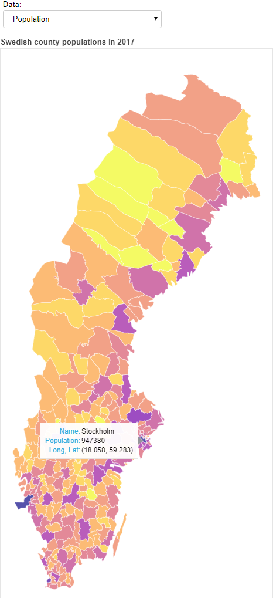

# Bokeh - Swedish county data visualisation
This repo contains a simple script for visualising per-county data using bokeh, resulting in a html output that can be viewed in a browser.


## Setup
No setup is needed, unless additional data is wanted. A good datasource for Swedish county data is 
https://www.scb.se/hitta-statistik/statistik-efter-amne/befolkning/befolkningens-sammansattning/befolkningsstatistik/
where many types of data collected by the Swedish Central Statistics Agency can be found.

### Prerequisites
The code requires
```
Python 3+
bokeh
numpy
pandas
```
In addition, any additional data used for visuals should have a column for county names, so that they can be sorted in the correct order for rendering.

### Running
The simplest way to run the visuals is simply
```
python sweden_vis.py
```
which gives a static view of the visualisation. This is good for debugging, to se that the Python script runs without errors. To run an interactive session, which allows for selecting which data to visualise, run
```
bokeh serve --show .\sweden_vis.py
```

## Credit where credit is due
This project was heavily inspired by the following Bokeh gallery example
```
https://bokeh.pydata.org/en/latest/docs/gallery/texas.html
```
The Swedish county geodata was obtained from
```
https://github.com/marcusasplund/kommundata
```
with a few modifications to remove small islands in a few counties.